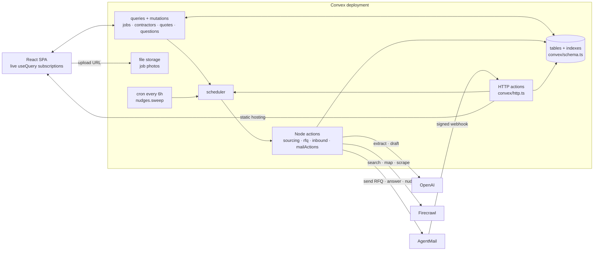
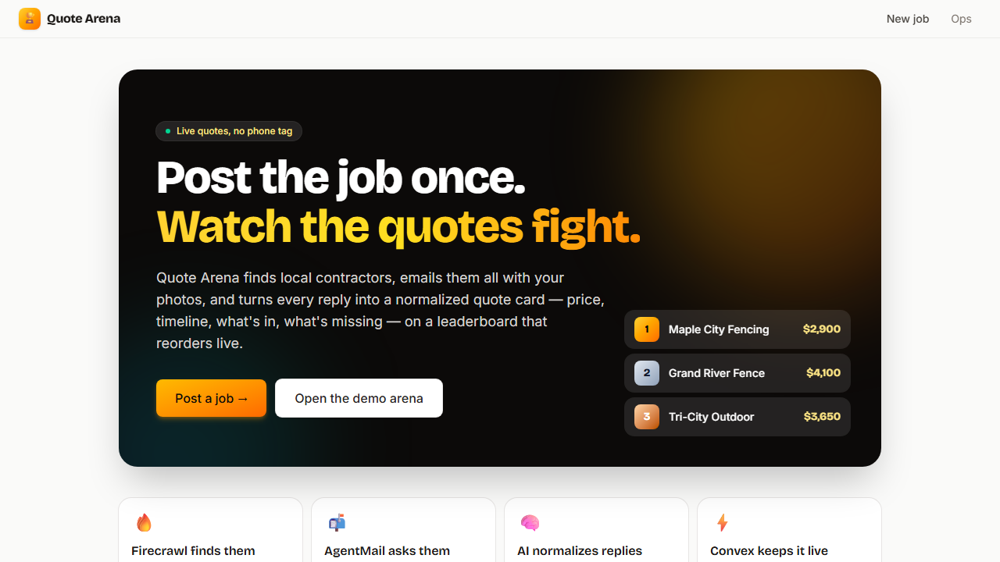
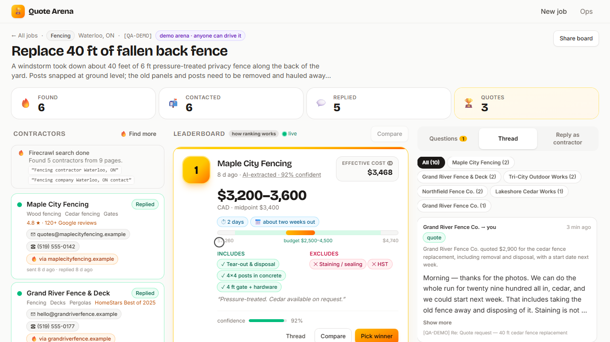
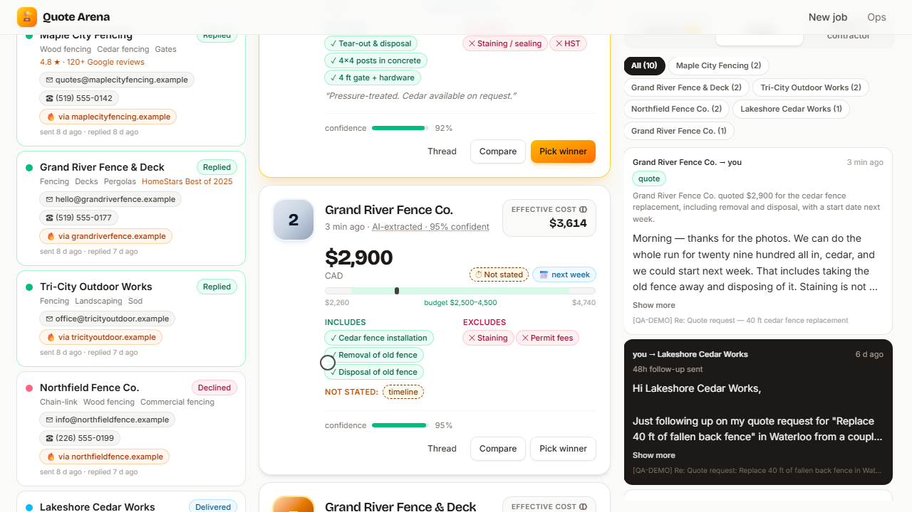
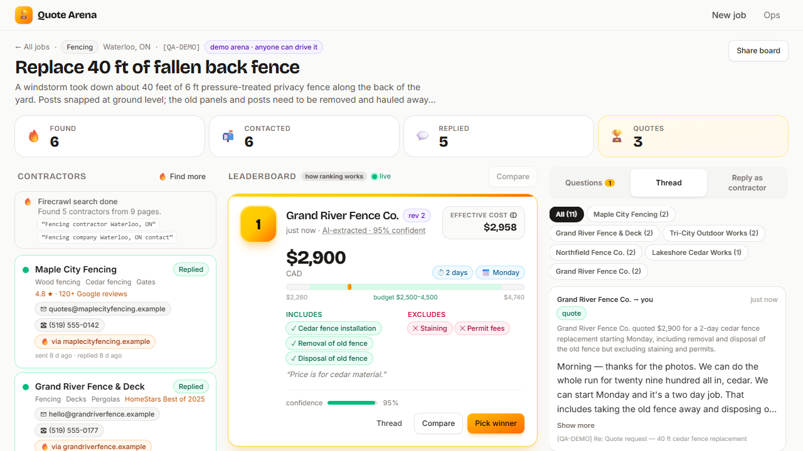

# 🏟️ Quote Arena

*Post a home-repair job once. Watch the quotes fight it out on a live leaderboard.*

🌐 **[Live demo](https://polished-dragon-158.convex.site)** · 🎬 Demo video: `TODO: video link` · 📓 [Build log](hackathon.md)
Jump straight to a populated board: **[/j/demo-back-fence](https://polished-dragon-158.convex.site/j/demo-back-fence)**

> ⚠️ The demo runs on free tiers of Convex, OpenAI, Firecrawl and AgentMail, so under load some features may be rate-limited — the video shows the full flow.

## ✨ What this is

Quote Arena is for the homeowner who needs three quotes for a fence, a leaking roof or a bathroom, and does not want to spend an evening on the phone. You describe the job once and add photos. It finds local contractors on the web, emails every one of them from a single inbox, and turns each reply into a normalized quote card — price, timeline, what's included, what they left out — on a leaderboard that reorders itself the moment a new reply lands. When a contractor writes back with a question, it drafts the answer from your job details and waits for you to approve it.

## 😩 The problem

Getting quotes is three chores stacked on top of each other. First you hunt for contractors who actually cover your area and still answer email. Then you write the same message eight times, re-attaching the same photos and re-explaining the same gate width. Then the replies trickle in over two weeks and none of them are comparable: one is "$2,900 all in", one is "$3,200–3,600 plus staining", one quotes a day rate, and only one of them mentions when they could start. The cheapest-looking number is often the one that left the most out, and you find that out after you have hired them.

## 💡 Our solution

1. **Post the job once.** Trade, description, city, timing, budget band, and photos (dragged straight into the form).
2. **Contractors appear while you watch.** Firecrawl searches the web for local businesses, reads their pages, and rows fill in live with a "via their-site.example" link back to where each one was found.
3. **Pick who to ask, then send one blast.** One RFQ email goes to every selected contractor from a single inbox, with your photo links inline and a short case code in the subject line.
4. **Replies become quote cards.** Every inbound email is classified and normalized into price, timeline, earliest start, includes and excludes — and lands on the leaderboard.
5. **The board reorders live.** A revised quote supersedes the old one, the card animates into its new position, and the ranking formula is shown right there on the card.
6. **Questions get answered.** "Is the ground level?" gets a drafted reply built only from your job facts, which you approve, edit, or dismiss.
7. **Nobody is left hanging.** A cron nudges non-responders once after 48 hours; picking a winner sends everyone else a polite note.

## 🧩 How we used each sponsor

| Sponsor | What it does in Quote Arena | Where in the code |
|---|---|---|
| ⚡ **Convex** | The whole backend: schema and indexes, live queries, mutations, Node actions, HTTP actions, scheduler, cron, file storage for photos, Convex Auth, components, and static hosting of the app itself | all of `convex/`, `convex/http.ts`, `convex/crons.ts`, `convex/schema.ts` |
| 🧠 **OpenAI** | Extracts contractors from crawled pages, drafts the RFQ email, classifies every reply and pulls a structured quote out of it, drafts answers to contractor questions | `convex/lib/llm.ts`, `convex/lib/quoteAi.ts`, `convex/inbound.ts`, `convex/sourcing.ts`, `convex/rfq.ts` |
| 🔥 **Firecrawl** | Searches for local contractors, reads their sites, and maps + scrapes contact pages to find a missing email address | `convex/lib/firecrawl.ts`, `convex/sourcing.ts` |
| 📬 **AgentMail** | Runs the app's inbox: sends every RFQ, answer, nudge and courtesy note, and delivers replies back in through a signed webhook | `convex/lib/agentmail.ts`, `convex/mailActions.ts`, `convex/http.ts`, `convex/mail.ts` |

### ⚡ Convex

Convex is not a database behind this app — it is the app.

- **Schema and indexes** (`convex/schema.ts`): `jobs`, `jobMembers`, `contractors`, `quotes`, `messages`, `questions`, plus mail (`mailMessages`, `settings`, `senderRoutes`) and ops tables (`usage`, `aiHealth`, `crawlCache`, `crawlBudget`). Every read path has an index: `quotes.by_job_active` on `["jobId", "supersededBy"]` gives the leaderboard only live quotes; `contractors.by_thread` routes an inbound email to the contractor who sent it; `jobs.by_caseCode` routes it to the job.
- **Queries** — all live subscriptions, nothing polls: `quotes.leaderboard` (ranks and returns the formula), `contractors.list`, `jobs.getBySlug`, `messages.forJob`, `questions.forJob`, `aiHealth.status`, `crawlCache.status`, `usage.today`.
- **Mutations**: `jobs.create`, `contractors.sendRequests`, `questions.approve`, `jobs.decide`, `jobs.rediscover`, plus internal ones the actions write through (`quotes.insert`, `contractors.upsertFromCrawl`, `mail.ingest`).
- **Node actions** (`"use node"`, where the SDKs live): `sourcing.discover`, `rfq.send` / `sendAnswer` / `nudge` / `sendCourtesy`, `inbound.onInbound`, `mailActions.send`.
- **HTTP actions** (`convex/http.ts`): the Convex Auth routes, and `POST /api/agentmail/webhook`, which verifies the Svix signature with Web Crypto (`convex/lib/svix.ts`), stores the mail and returns 200 immediately — all AI work is scheduled, so a slow model can never cause a webhook retry storm.
- **Scheduler**: `ctx.scheduler.runAfter` is the seam between "the UI reacted instantly" and "the slow work happened" — `jobs.create` → `sourcing.discover`, `contractors.sendRequests` → `rfq.send`, `mail.ingest` → `inbound.onInbound`, `jobs.decide` → `rfq.sendCourtesy`.
- **Cron** (`convex/crons.ts`): every 6 hours, `nudges.sweep` finds contractors emailed more than 48 hours ago with no reply and schedules exactly one follow-up each.
- **File storage**: `jobs.generateUploadUrl` hands the browser an upload URL (`src/pages/NewJob.tsx` POSTs the file to it), photo ids are stored on the job, and `ctx.storage.getUrl` turns them into links that go out inside the RFQ email.
- **Convex Auth** (`convex/auth.ts`): anonymous sign-in is the primary path, so a judge who opens the URL is already in with no login wall; Password sign-in exists so a real user can come back. `convex/lib/access.ts` enforces who may read a board and who may drive it.
- **Components** (`convex/convex.config.ts`): `@convex-dev/static-hosting` serves the React app as the catch-all route in `convex/http.ts`, so the app and its backend are one deployment on one origin; `@convex-dev/rate-limiter` powers the per-user and global quotas in `convex/lib/limits.ts`. (`@convex-dev/agent` is also registered, but the shipped flows call the model directly through `convex/lib/llm.ts`.)

### 🧠 OpenAI

One module talks to the model (`convex/lib/llm.ts`) and exposes exactly two verbs: `draft()` for prose and `extract()` for structured output, where a zod schema is sent as JSON Schema and the reply is parsed and validated before it can become a row. Four jobs use it:

- **Contractor extraction** — one call turns a batch of crawled pages into names, emails, phones, service areas and a `isDirectory` flag that throws out review sites and listicles (`ContractorBatchSchema`, `convex/sourcing.ts`).
- **RFQ drafting** — writes the request-for-quote email in the homeowner's voice, with the photo links inlined (`convex/rfq.ts`).
- **Reply understanding** — classifies each inbound email (`quote` / `question` / `decline` / `auto_reply` / `other`), extracts the quote fields, and lists every question asked, all in one call (`InboundAnalysisSchema`, `convex/inbound.ts`).
- **Answer drafting** — answers contractor questions from the job facts only, and sets `grounded: false` when the facts do not actually cover the question, so a guess never gets auto-sent.

Every call goes through `aiExtract` / `aiDraft` in `convex/lib/quoteAi.ts`, which apply a pause switch, a circuit breaker (`convex/aiHealth.ts`), rate limits, usage metering and a soft timeout. If the endpoint is slow or down, regex heuristics take over, the row is stamped `model: "heuristic"`, and the UI says so instead of showing a blank card.

### 🔥 Firecrawl

`convex/sourcing.ts` runs two Firecrawl searches per job (`"<trade> contractor <city>"` and `"<trade> company <city> contact"`), de-duplicates the hits by host, drops known directory domains, and feeds the page markdown to the extractor. For any contractor whose homepage had no email, it uses `map` to list the site's URLs, finds a contact/quote page, and `scrape`s that one page for an address — capped at three per run. What the crawl produces is what the user sees: the contractor list, the "via their-site.example" source link on each card, and the status line "Found 5 contractors from 9 pages".

Because the crawl budget is shared and public, every call goes through one gateway in `convex/lib/firecrawl.ts` that serves a stored result when it has one, checks Firecrawl's own credit-usage endpoint before spending, and refuses to go below a reserve or over a daily cap. A refusal is not an error — the board keeps what it has and the UI says "showing saved results".

### 📬 AgentMail

The app owns exactly one AgentMail inbox, created idempotently by client id (`mailActions.ensureInbox`) — its address is shown on the app's Ops page. Every outbound email goes through `mailActions.send`: the RFQ blast, answers to questions, the 48-hour nudge, and the courtesy note to everyone who did not win. Each subject carries a short case code such as `[QA-DEMO]`.

Inbound is the interesting half. AgentMail posts to `/api/agentmail/webhook`; the signature is verified, then `mail.ingest` de-duplicates by message id and routes the mail to a job by **thread id first, then the case code in the subject, then a known sender address**, and schedules the analysis. `message.delivered` and `message.bounced` events update the contractor's status on the board. During development every send is redirected by `DEMO_RECIPIENT_OVERRIDE`, and real sending has to be turned on deliberately — we never emailed a real business from a dev box.

## 🔍 How it works



The core loop, function by function:

1. `jobs.create` writes the job (photos already in file storage) and schedules `sourcing.discover`.
2. `sourcing.discover` searches with Firecrawl, extracts businesses with OpenAI, and writes rows through `contractors.upsertFromCrawl` — the list fills in live because `contractors.list` is a subscription.
3. `contractors.sendRequests` marks the chosen contractors `queued` (the UI reacts at once) and schedules `rfq.send`.
4. `rfq.send` drafts the email once, then sends per contractor through `mailActions.send`, recording the thread id so replies can find their way home.
5. A contractor replies. AgentMail posts to `/api/agentmail/webhook`, the signature is checked, `mail.ingest` stores and routes it, and `inbound.onInbound` is scheduled.
6. `inbound.onInbound` classifies the email, and on a price writes `quotes.insert`, which supersedes that contractor's earlier quote.
7. `quotes.leaderboard` re-ranks and every open board reorders — no refresh, no polling.
8. Questions become `questions` rows with a drafted answer; `questions.approve` schedules `rfq.sendAnswer`.
9. `nudges.sweep` (cron) follows up after 48 hours; `jobs.decide` picks a winner and schedules `rfq.sendCourtesy`.

### The ranking formula, in the open

A cheap number is not a cheap job. The leaderboard ranks by an **effective cost** that charges a quote for waiting and for vagueness (`convex/lib/ranking.ts`):

```
effective cost = price midpoint
               × (1 + 1% per day of timeline)      waiting has a cost
               × (1 + 3% per unstated field)       vagueness has a cost
```

The four fields checked are price, timeline, start date, and what's included. A quote with no stated timeline is assumed to take 21 days *and* takes the missing-field penalty. Lower wins; a reply with no price at all cannot be ranked and sits at the bottom flagged "needs a price".

This is a product decision, not a scoring trick, so the formula is not hidden: the same module computes the server-side ranking and feeds the "how ranking works" tooltip and the per-card breakdown in the UI. Worked example from the demo arena:

| Quote | Price | Timeline | Effective cost |
|---|---|---|---|
| Maple City Fencing | $3,200–3,600 | 2 days, starts ~2 weeks out | **$3,468** |
| Grand River Fence Co. (first reply) | $2,900 | *not stated* | **$3,614** |
| Grand River Fence Co. (revised reply) | $2,900 | 2 days, starts Monday | **$2,958** |

The $2,900 quote loses to the $3,400 one until it says when it can start — then it takes first place. That is the whole point.

## 📸 Screenshots

| | |
|---|---|
|  |  |
| **Post the job once.** The pitch, and a button straight into the seeded demo arena. | **One board per job.** Contractors on the left with their Firecrawl source, the leaderboard in the middle, the email thread on the right. |
|  |  |
| **Vagueness costs.** $2,900 with no stated timeline scores $3,614 and sits at #2, with the missing field called out on the card. | **A revised reply lands and the board reorders.** The same contractor, now with "2 days, Monday", takes #1 at $2,958. |

## 🚀 Running it yourself

```bash
pnpm install
pnpm dlx convex dev          # creates a dev deployment and writes CONVEX_DEPLOYMENT / VITE_CONVEX_URL
pnpm dev                     # the Vite dev server
pnpm run build && pnpm run deploy   # build and publish to Convex static hosting
```

Set these on the deployment with `pnpm dlx convex env set <NAME> <value>` — names only, values never live in the repo (see `.env.example`):

- Convex Auth: `JWT_PRIVATE_KEY`, `JWKS`, `SITE_URL`
- OpenAI: `LLM_BASE_URL`, `LLM_API_KEY`, `LLM_MODEL`, optional `LLM_VISION_MODEL`
- Firecrawl: `FIRECRAWL_API_KEY`
- AgentMail: `AGENTMAIL_API_KEY`, `AGENTMAIL_WEBHOOK_SECRET`
- Safety rails: `DEMO_RECIPIENT_OVERRIDE` (redirect all outbound mail), `ALLOW_REAL_SENDS`, `APP_PAUSED`

Then seed the demo arena with `pnpm exec convex run seed:demo` and point AgentMail's webhook at `https://<your-deployment>.convex.site/api/agentmail/webhook`.

## 🙏 Credits

Built for the **Convex All Gas Hackathon**, sponsored by OpenAI, Firecrawl and AgentMail.
Backend, realtime, auth, scheduling and hosting by [Convex](https://convex.dev) · web search and scraping by [Firecrawl](https://firecrawl.dev) · email by [AgentMail](https://agentmail.to) · language model by OpenAI.
